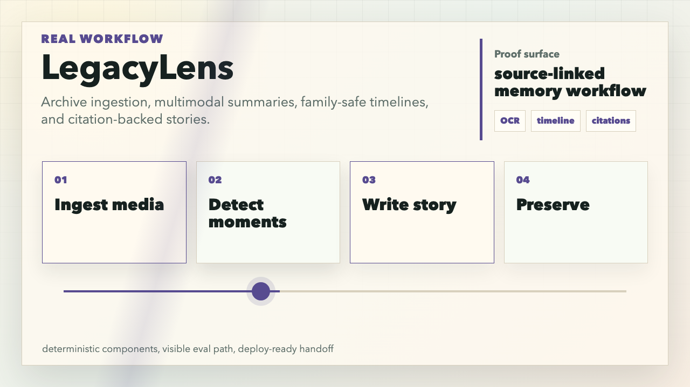
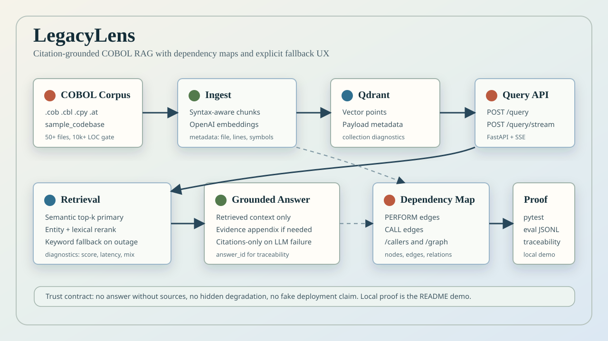

# LegacyLens

LegacyLens is a FastAPI RAG system for legacy COBOL codebases. It ingests COBOL files, chunks them around real program structure, indexes them in Qdrant, answers natural-language questions with file/line citations, and exposes dependency graph endpoints for `PERFORM` and `CALL` relationships.

No public deployment URL is attached in this repo yet. The demo path below is local and reproducible.



[Watch the 8-second workflow video](docs/assets/legacy-lens-workflow.mp4)



## What It Proves

| Capability | Proof surface |
| --- | --- |
| COBOL ingestion | `python -m legacylens ingest --codebase src/legacylens/sample_codebase` discovers `.cob`, `.cbl`, `.cpy`, `.cobol`, and `.at` files, chunks them, embeds them, writes Qdrant points, and saves `.legacylens/dependency_graph.json`. |
| Citation-grounded answers | `POST /query` returns `answer_id`, `answer`, `sources[]`, `diagnostics`, `confidence_label`, `fallback`, and `query_meta`. Every source includes `citation`, `file_path`, `line_start`, `line_end`, score, and COBOL metadata. |
| Retrieval with fallback | Semantic search is primary. If embeddings or Qdrant fail, LegacyLens falls back to keyword search and marks `fallback.active=true`, `mode=keyword`, and a reason such as `embedding_error` or `qdrant_timeout`. |
| Citations-only degradation | If answer generation fails after retrieval succeeds, the API returns citation-only output with `mode=citations_only` instead of inventing prose. |
| Dependency map | Ingestion extracts `PERFORM` and `CALL` relationships. `/callers/{symbol}` returns callers, and `/graph/{symbol}` returns nodes, edges, relation types, and graph summary counts. |
| Evals and tests | `pytest -q` covers ingest, chunking, retrieval, fallback, citations, streaming, graph behavior, corpus gates, and eval helpers. `eval/ground_truth.sample.jsonl` provides a labeled retrieval fixture. |

## Local Demo

Start Qdrant:

```bash
docker run --rm -p 6333:6333 qdrant/qdrant
```

Install and configure:

```bash
python -m venv .venv
source .venv/bin/activate
pip install -e ".[dev]"
export OPENAI_API_KEY="..."
export QDRANT_URL="http://localhost:6333"
```

Ingest the bundled COBOL sample corpus:

```bash
python -m legacylens ingest --codebase src/legacylens/sample_codebase
```

Run the API and web console:

```bash
uvicorn legacylens.api:app --reload
```

Open `http://127.0.0.1:8000`, or query the API directly:

```bash
curl -X POST http://127.0.0.1:8000/query \
  -H "content-type: application/json" \
  -d '{"query":"Where is file I/O handled?","codebase_path":"src/legacylens/sample_codebase"}'
```

Inspect graph context for a symbol:

```bash
curl "http://127.0.0.1:8000/graph/READ-FILE?codebase_path=src/legacylens/sample_codebase"
```

## API Surface

| Endpoint | Purpose |
| --- | --- |
| `GET /` | Web console. |
| `GET /health` | Health check. |
| `GET /meta` | Runtime metadata, configured models, Qdrant collection, and endpoint map. |
| `POST /query` | Non-streaming answer with citations, diagnostics, and fallback metadata. |
| `POST /query/stream` | SSE answer stream with `context`, `token`, `done`, and `error` events. |
| `GET /callers/{symbol}` | Caller lookup from dependency graph. |
| `GET /graph/{symbol}` | Symbol neighborhood graph with typed `perform` and `call` relations when available. |

## Response Shape

Successful `POST /query` responses include:

```json
{
  "answer_id": "ans_20260701T000000Z_ab12cd34",
  "answer": "Grounded explanation with citations.",
  "sources": [
    {
      "citation": "[run_file.at:2763-2763]",
      "score": 0.86,
      "file_path": "run_file.at",
      "line_start": 2763,
      "line_end": 2763,
      "symbol_type": "paragraph",
      "symbol_name": "READ-FILE",
      "language": "cobol"
    }
  ],
  "diagnostics": {
    "latency_ms": 120,
    "top1_score": 0.86,
    "chunks_returned": 1,
    "hybrid_triggered": false,
    "semantic_hits": 1,
    "fallback_hits": 0,
    "confidence_level": "high"
  },
  "fallback": {
    "active": false,
    "mode": null,
    "reason": null,
    "severity": null,
    "degraded_quality": false
  }
}
```

Low-signal questions are rejected with actionable hints, empty indexes are called out before querying, and weak evidence can return `422` with suggested query anchors instead of a loose answer.

## Architecture

1. Discover COBOL-like files under the configured codebase.
2. Chunk with COBOL-aware structure from `src/legacylens/chunking/cobol.py`; use fallback chunks when structure is unclear.
3. Generate embeddings with the configured provider and model.
4. Upsert vectors and metadata into Qdrant.
5. Build a dependency graph from `PERFORM` and `CALL` references.
6. Retrieve with semantic search, rerank with lexical/entity signals, then fall back to keyword search when semantic retrieval is unavailable or empty.
7. Generate an OpenAI-backed answer using only retrieved context and append evidence when the model omits citations.
8. Return citations, diagnostics, confidence, fallback state, and query metadata to the API/UI.

More detail: `docs/ARCHITECTURE.md`, `docs/SETUP.md`, `docs/TRACEABILITY.md`, and `docs/REQUIREMENTS-CHECKLIST.md`.

## Docker

Build and run the API container:

```bash
docker build -t legacylens .
docker run --rm -p 8000:8000 --env-file .env legacylens
```

Run Qdrant separately or point `QDRANT_URL` at an existing instance. The image starts `uvicorn legacylens.api:app --host 0.0.0.0 --port 8000`.

## Evaluation And Verification

Run the main gate:

```bash
pytest -q
```

Run corpus and traceability checks when a `data/` corpus is present:

```bash
python scripts/validate_corpus.py --codebase data
python scripts/validate_traceability.py
```

Run a labeled retrieval eval after ingestion:

```bash
python -m legacylens eval \
  --dataset eval/ground_truth.sample.jsonl \
  --codebase src/legacylens/sample_codebase \
  --k 5 \
  --out /tmp/legacylens-eval.jsonl
```

## Tech Stack

- FastAPI and Uvicorn
- Qdrant vector store
- OpenAI embeddings, default `text-embedding-3-small`
- OpenAI chat completions for answer generation
- LangSmith export when `LANGCHAIN_API_KEY` is configured
- Pytest coverage for API, retrieval, fallback, graph, streaming, corpus, and eval behavior
